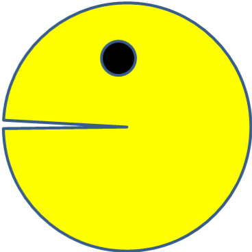

# PacMen Exercise

Module 7 assignment designed to show understanding of basic animation in Javascript. 

## How to Run

Click "Add PacMan" to add a single PacMan to the window. Add as many as you'd like!
 
Click "Start Game" to move the PacMen across the screen.

## Have Fun!

